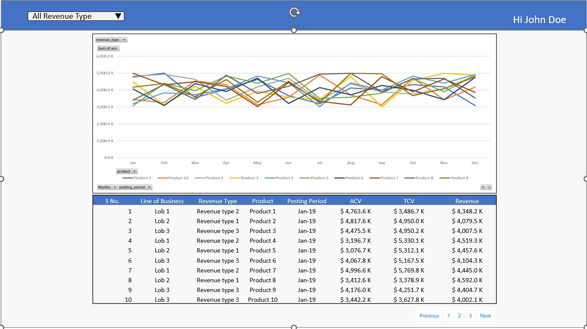

### Application Link : [Demo](https://preeminent-otter-31a9ed.netlify.app/)
### Problem Statement
* ### Create the view in react
    * Navigation bar with drop down for Revenue Type on right and a greeting for user on the left.
    * Create required line chart, with ACV on y axis, Posting period on X axis and filter for Revenue Type.
    * Drop down menu Options is to load either one of the Revenue type or load all.
    * Bonus: Let user select any number of Revenue Type (not just 1 or All)
    * Create a table below the chart which shows row level data and filter using the drop-down menu.
    * Table data is at row level and will be plugged directly.
    * Table data is at row level and will be plugged directly.
    * Any open source chart available and feasible like D3, High can be used 

  

### Application Link : [Demo](https://preeminent-otter-31a9ed.netlify.app/)

This is a WhatsApp web client Application, which supports basic features of WhatsApp web.
### Features are:
1. You can login using your google account.
2. Self chat for personal use.
3. One to One private chat with a friend.

## Tech Stack :
* ### Client Application
    * ReactJS, Typescript,Highcharts Library, HTML/CSS

## Hosted On : 
1. ### [Netlify](https://www.netlify.com/)
    Revenue Chart Application is hosted on Netlify.

## Getting Started with the project
* Clone the repository in you local machine
    * Development Mode
        * npm run start
    * Production Mode
        * npm run build

## ✍️ Authors 
- [@Sonu Shahuji]